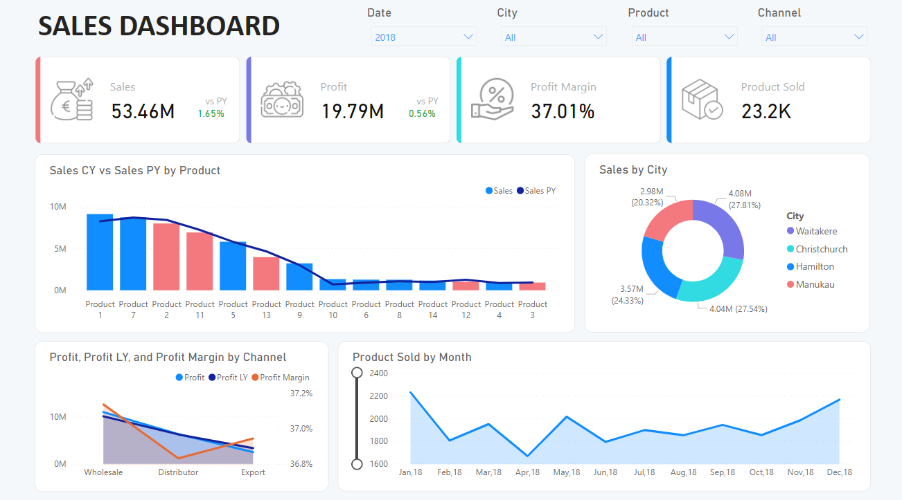

# 📊 Sales Dashboard Analysis with Power BI

## 📑 Introduction

This repository outlines the development of a **Sales Dashboard** using **Power BI** aimed at providing valuable insights to stakeholders such as sales managers and executives. The dashboard is designed to analyze sales performance, helping stakeholders better understand year-over-year trends and performance. 

The objective is to visualize key performance indicators (KPIs) and offer a comprehensive breakdown of sales data with interactive elements.



## ⚙️ Requirements

### 🎯 Dashboard Purpose:
The **Sales Dashboard** aims to provide a high-level overview of sales metrics, allowing stakeholders to analyze sales performance across different dimensions. The main objectives of this report are as follows:

1. **💰 Total Sales**: Show the overall sales value for the selected year.
2. **📈 Total Profit**: Visualize the profit achieved for the selected period.
3. **📦 Orders**: Display the number of orders placed within the specified date range.
4. **📊 Profit Margin**: Calculate and visualize the profit margin percentage to evaluate profitability.
5. **🌍 Top 4 Cities**: Highlight the four top-performing cities based on sales data.
6. **🔍 Dynamic Filters**: Interactive filters allow users to slice the data by Date, City, Product, and Channel for a more personalized analysis.

## 🛠️ Process Overview

### 1. **📥 Gathering Data**
The data required for analysis was sourced from four key tables:
- **📦 Sales Orders**
- **👥 Customers**
- **🌍 Regions**
- **🛍️ Products**

Dataset: `Sales Analysis Report.xlsx`

### 2. **🔄 Power Query - Data Extraction, Transformation, and Load (ETL)**
Data cleaning and transformation were performed using the **Power Query Editor** within Power BI. Key steps in this phase:
- 🧹 Removed duplicates and handled missing values.
- 🔗 Merged datasets for a more cohesive model.
- ➕ Created calculated columns as needed for the analysis.
- 📅 Built a Date Table to simplify DAX (Data Analysis Expressions) calculations.

*Other steps included during this process involved creating a date table for our model to facilitate working with DAX.*

### 3. **🔗 Data Modeling**
A comprehensive **Data Model** was created by establishing relationships between the tables, enabling efficient analysis and insight generation. Calculated **Measures** were created using DAX to perform aggregations and other calculations. 

#### 🧮 Key DAX Formulas:
```DAX
Sales = SUM(Sales_Data[Sales])
Sales PY = CALCULATE([Sales], SAMEPERIODLASTYEAR(DateTable[Date]))
Sales vs PY = [Sales] - [Sales PY]
Sales vs PY % = DIVIDE([Sales vs PY],[Sales],0)
Products Sold = SUM(Sales_Data[Order Quantity])
Profit = SUM(Sales_Data[Profit])
Profit LY = CALCULATE([Profit], SAMEPERIODLASTYEAR(DateTable[Date]))
Profit Vs LY = [Profit]- [Profit LY]
Profit vs LY % = [Profit Vs LY]/[Profit]
Profit Margin = DIVIDE([Profit],[Sales],0)
Total Cost = SUM(Sales_Data[Total Cost])
```

### 4. 📊 **Data Analysis & Visualization**
Using the data model and DAX measures, the following visualizations were created:

- **Sales Overview:** A high-level KPI summary of total sales, profit, and the number of products sold.
- **Top 4 Cities:** A bar chart showing the top cities based on sales performance.
- **Sales Trend:** A line chart to visualize year-over-year sales trends.
- **Profit Margin:** A visualization to display profit margins across different years and channels.
- **Orders & Profit Breakdown:** Additional filters for analyzing sales orders and profits by product, channel, and city.

 

### 5. 📝 **Conclusion & Insights** 
Key insights Sales Dashboard:

- ⬇️ Sales Decrease: Sales in 2019 showed a 10% decline compared to 2018.
- ⬇️ Profit Decrease: Profit also decreased by 8% compared to the previous year.
- 📉 Top Products: 10 products saw a significant decrease in sales compared to 2018.
- 📊 Channel Insights: Profit margins were higher in the Export Channel compared to other channels like Distributor and Wholesale.
- 📅 Monthly Trends: The highest product sales were recorded in October (2065 units sold), while December saw the lowest sales (823 units).


**🛠️ Tools & Technologies**
- **Power BI:** Used to create the data model, visualizations, and the dashboard.
- **DAX:** Used for creating calculated measures for sales, profit, and other KPIs.
- **Power Query:** Used for data extraction, transformation, and loading (ETL).
- **Excel:** The dataset is composed of tables including Sales Orders, Customers, Regions, and Products.
